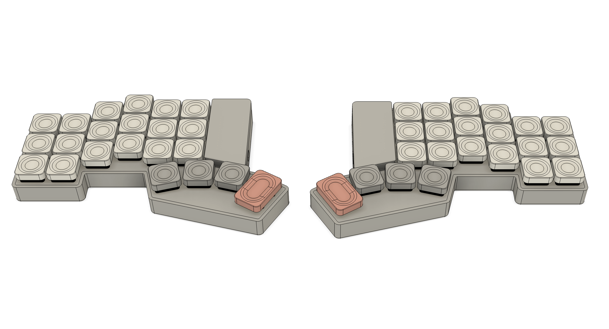

# Spliteo

Ergonomic split keyboard with a 3x6 matrix layout and a 4 key thumb cluster.

## Bill of Materials

| Part                                                 | Quantity | Estimated Price | Source                                            |
| ---------------------------------------------------- | -------- | --------------- | ------------------------------------------------- |
| Custom PCB                                           | 1        | 9.06$           | https://jlcpcb.com                                |
| Low-profile Keycaps                                  | 1 set    | 19.44$          | https://item.taobao.com/item.htm?id=873448851434  |
| Hot-swappable switch connector (Choc v2 - 1350/1353) | 44       | 8.08$           | https://detail.tmall.com/item.htm?id=640063427738 |
| Kailh Full POM Black cloud                           | 44       | 24.22$          | https://detail.tmall.com/item.htm?id=813618264203 |
| Promicro Nrf52840 (Compatible with Nice!Nano V2.0)   | 2        | 4.22$           | https://item.taobao.com/item.htm?id=799443140168  |
| Shipping Costs                                       | -        | 30,98$          | https://www.acbuy.com                             |
| **Total**                                            |          | **96.00$**      |                                                   |

